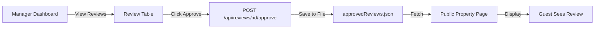

# 🎯 Flex Living Reviews Dashboard - Complete Implementation Guide

## Overview

This document explains the complete implementation of the Flex Living Reviews Dashboard, including the public review display page and Google Reviews integration exploration.

---

## 📋 Table of Contents

1. [Architecture Overview](#architecture-overview)
2. [Review Display Page (Public Property Page)](#review-display-page)
3. [How Approval Workflow Works](#approval-workflow)
4. [Google Reviews Integration](#google-reviews-integration)
5. [Testing Guide](#testing-guide)
6. [API Endpoints](#api-endpoints)
7. [Troubleshooting](#troubleshooting)

---

## 🏗️ Architecture Overview

### Backend Structure
```
backend/
├── server.js                      # Express server with CORS config
├── .env                           # Environment variables (API keys)
├── routes/
│   └── reviews.js                 # All review routes
├── controllers/
│   └── reviewController.js        # Business logic for reviews
├── services/
│   └── hostawayService.js         # Hostaway API integration (mocked)
├── utils/
│   └── normalizeReviews.js        # Data normalization logic
├── data/
│   ├── mockReviews.json           # Mock Hostaway data
│   └── approvedReviews.json       # Stored approved reviews
└── mock/
    └── reviews.json               # Alternative mock data location
```

### Frontend Structure
```
frontend/
├── src/
│   ├── App.jsx                    # Main app with routing
│   ├── pages/
│   │   ├── DashboardPage.jsx      # Manager dashboard wrapper
│   │   └── PropertyPage.jsx       # Public property page ⭐ NEW
│   ├── components/
│   │   ├── Dashboard.jsx          # Dashboard logic & filters
│   │   ├── ReviewTable.jsx        # Reviews table with approve button
│   │   ├── ReviewCard.jsx         # Individual review card
│   │   └── Filters.jsx            # Filter controls
│   └── services/
│       └── api.js                 # Axios API client
├── .env                           # Frontend config
└── vite.config.js                 # Vite with proxy config
```

---

## 🌐 Review Display Page (Public Property Page)

### What It Does

The **PropertyPage.jsx** component creates a public-facing property details page that:
- ✅ Displays ONLY approved reviews
- ✅ Shows property information and overall rating
- ✅ Mimics Flex Living's website design
- ✅ Provides beautiful review cards with ratings
- ✅ Shows aggregate statistics

### Implementation Details

#### Route Setup
```jsx
// In App.jsx
<Route path="/property/:listingId" element={<PropertyPage />} />
```

#### Key Features

1. **Dynamic Property Loading**
   - URL: `http://localhost:3000/property/101`
   - Fetches approved reviews for that specific property
   - Displays property name, average rating, review count

2. **Approved Reviews Only**
   ```jsx
   const fetchApprovedReviews = async () => {
     const response = await axios.get('/api/reviews/approved');
     const filtered = response.data.filter(
       r => r.listing_name === listingName
     );
     setReviews(filtered);
   };
   ```

3. **Beautiful UI Design**
   - Hero section with property name and rating
   - Review cards with guest info, ratings, and comments
   - Category ratings breakdown
   - Responsive grid layout

4. **Rating Display**
   - Star visualization (★★★★★)
   - Numeric rating (e.g., 9.5/10)
   - Color-coded badges for categories

### How to Use

1. **Access the Public Page**
   ```
   http://localhost:3000/property/[LISTING_NAME]
   ```
   
   Examples:
   - `http://localhost:3000/property/2B%20N1%20A%20-%2029%20Shoreditch%20Heights`
   - `http://localhost:3000/property/1B%20E1%20A%20-%2039%20Shoreditch%20Heights`

2. **Navigation**
   - Click "Public View" in the navbar
   - Or directly enter the URL

3. **What You'll See**
   - Property header with average rating
   - Total review count
   - Individual review cards showing:
     - Guest name and avatar
     - Review date
     - Star rating
     - Review text
     - Category ratings (cleanliness, communication, etc.)
     - Channel badge (Airbnb, Booking.com, etc.)

---

## ✅ Approval Workflow

### How It Works



### Step-by-Step Process

#### 1. Manager Views Reviews
```
URL: http://localhost:3000/
```
- Dashboard fetches ALL reviews from `/api/reviews/hostaway`
- Displays in filterable table
- Shows approval button for each review

#### 2. Manager Approves Review
```javascript
// Frontend: Dashboard.jsx
const handleApprove = async (reviewId) => {
  await reviewsAPI.approveReview(reviewId);
  alert('Review approved!');
};
```

```javascript
// Frontend: api.js
approveReview: (id) => api.post(`/reviews/${id}/approve`)
```

#### 3. Backend Processes Approval
```javascript
// Backend: controllers/reviewController.js
exports.approveReview = async (req, res) => {
  const { id } = req.params;
  
  // 1. Find the review
  const review = allReviews.find(r => r.id === parseInt(id));
  
  // 2. Add approval metadata
  review.approved_at = new Date().toISOString();
  review.is_approved = true;
  
  // 3. Save to approvedReviews.json
  fs.writeFileSync(approvedPath, JSON.stringify(approved, null, 2));
  
  // 4. Return success
  res.json({ status: 'success', review });
};
```

#### 4. Public Page Displays Approved Review
```javascript
// Frontend: PropertyPage.jsx
const fetchApprovedReviews = async () => {
  const response = await axios.get('/api/reviews/approved');
  // Filter by property
  const filtered = response.data.filter(
    r => r.listing_name === listingName
  );
  setReviews(filtered);
};
```

### File Structure for Approvals

```json
// backend/data/approvedReviews.json
[
  {
    "id": 7462,
    "guest_name": "Shane Finkelstein",
    "listing_name": "2B N1 A - 29 Shoreditch Heights",
    "average_rating": 10,
    "comment": "Shane and family are wonderful!",
    "submitted_at": "2020-08-21 22:45:14",
    "approved_at": "2025-10-25T14:30:00.000Z",
    "is_approved": true
  }
]
```

---

## 🔍 Google Reviews Integration

### Current Status: ⚠️ **Exploration Phase**

### What We Found

Google Reviews integration is **technically possible** but has significant limitations:

#### ✅ What's Possible

1. **Google Places API**
   - Can fetch reviews for a location
   - Requires Place ID
   - Returns max 5 most relevant reviews
   - Provides: author, rating, text, time

2. **Google My Business API**
   - Better for business owners
   - Can fetch all reviews
   - Can respond to reviews
   - More detailed analytics

#### ❌ Limitations

1. **Cost**
   - Places API: $17 per 1,000 requests (Place Details)
   - Requires billing account setup
   - Not free tier available

2. **Data Restrictions**
   - Only 5 reviews per request
   - Cannot filter by date range
   - Cannot sort reviews
   - Limited metadata

3. **Access Requirements**
   - Need to verify business ownership
   - Requires Google Cloud account
   - Must enable APIs
   - API key management

4. **Quota Limits**
   - Default: 100 requests/day
   - Can request increase (paid)

### Implementation Guide (If You Proceed)

#### Step 1: Setup Google Cloud

```bash
# 1. Go to console.cloud.google.com
# 2. Create new project
# 3. Enable "Places API"
# 4. Create credentials (API Key)
# 5. Add billing information
```

#### Step 2: Install Dependencies

```bash
cd backend
npm install @googlemaps/google-maps-services-js
```

#### Step 3: Create Service

```javascript
// backend/services/googleReviewsService.js
const { Client } = require("@googlemaps/google-maps-services-js");

const client = new Client({});

exports.fetchGoogleReviews = async (placeId) => {
  try {
    const response = await client.placeDetails({
      params: {
        place_id: placeId,
        fields: ['reviews', 'rating', 'user_ratings_total'],
        key: process.env.GOOGLE_PLACES_API_KEY,
      }
    });
    
    return {
      reviews: response.data.result.reviews || [],
      average_rating: response.data.result.rating,
      total_reviews: response.data.result.user_ratings_total
    };
  } catch (error) {
    console.error('Google API Error:', error);
    throw error;
  }
};

// Normalize Google reviews to match our format
exports.normalizeGoogleReviews = (googleReviews) => {
  return googleReviews.map(review => ({
    id: `google_${review.time}`,
    guest_name: review.author_name,
    listing_name: 'From Google',
    average_rating: review.rating,
    comment: review.text,
    submitted_at: new Date(review.time * 1000).toISOString(),
    type: 'guest-to-host',
    status: 'published',
    source: 'google',
    profile_photo: review.profile_photo_url
  }));
};
```

#### Step 4: Add Route

```javascript
// backend/routes/reviews.js
const googleService = require('../services/googleReviewsService');

router.get('/google/:placeId', async (req, res) => {
  try {
    const { placeId } = req.params;
    const data = await googleService.fetchGoogleReviews(placeId);
    const normalized = googleService.normalizeGoogleReviews(data.reviews);
    
    res.json({
      status: 'success',
      source: 'google',
      count: normalized.length,
      reviews: normalized,
      meta: {
        average_rating: data.average_rating,
        total_reviews: data.total_reviews
      }
    });
  } catch (error) {
    res.status(500).json({ status: 'error', message: error.message });
  }
});
```

#### Step 5: Environment Variables

```bash
# backend/.env
GOOGLE_PLACES_API_KEY=your_api_key_here
```

#### Step 6: Frontend Integration

```javascript
// frontend/src/services/api.js
fetchGoogleReviews: (placeId) => 
  api.get(`/reviews/google/${placeId}`)
```

```jsx
// In Dashboard.jsx, add button to fetch Google reviews
const fetchGoogleReviews = async () => {
  const placeId = 'ChIJN1t_tDeuEmsRUsoyG83frY4'; // Example
  const response = await reviewsAPI.fetchGoogleReviews(placeId);
  // Merge with existing reviews
  setReviews([...reviews, ...response.data.reviews]);
};
```

### Finding Place IDs

1. **Using Google Maps**
   - Search for property address
   - Look in URL: `?...cid=XXXXXXXXX`
   - Use Place ID Finder: https://developers.google.com/maps/documentation/places/web-service/place-id

2. **Using Places API**
   ```javascript
   // Search for place by name/address
   const response = await client.findPlaceFromText({
     params: {
       input: '29 Shoreditch Heights, London',
       inputtype: 'textquery',
       fields: ['place_id', 'name'],
       key: process.env.GOOGLE_PLACES_API_KEY
     }
   });
   ```

### Recommendation

**We recommend NOT implementing Google Reviews initially because:**

1. ❌ **Cost**: $17 per 1,000 property views is expensive
2. ❌ **Limited Data**: Only 5 reviews per request
3. ❌ **Complexity**: Requires extensive Google Cloud setup
4. ❌ **Maintenance**: Need to manage quotas, billing, errors
5. ✅ **Alternative**: Use Hostaway which aggregates reviews from multiple platforms including Google

**Better Approach:**
- Use Hostaway's aggregation (they pull from Google, Airbnb, Booking.com)
- Focus on improving Hostaway integration
- Add direct booking platform integrations (Airbnb API, Booking.com API)

---

## 🧪 Testing Guide

### 1. Test Backend

```bash
# Start backend
cd backend
npm start

# Test endpoints
curl http://localhost:5000/health
curl http://localhost:5000/api/reviews/hostaway
curl http://localhost:5000/api/reviews/stats
curl http://localhost:5000/api/reviews/approved
```

### 2. Test Frontend

```bash
# Start frontend
cd frontend
npm run dev

# Open browser
http://localhost:3000
```

### 3. Test Approval Workflow

1. **Navigate to Dashboard**
   ```
   http://localhost:3000/
   ```

2. **Click "Approve" on any review**
   - Should see success message
   - Check backend logs for confirmation

3. **Verify approval saved**
   ```bash
   cat backend/data/approvedReviews.json
   ```

4. **View on public page**
   ```
   http://localhost:3000/property/[LISTING_NAME]
   ```

### 4. Test Filters

1. **By Rating**: Select "9+ Excellent" - should show only high-rated reviews
2. **By Listing**: Select specific property - should filter to that property
3. **By Type**: Select "Guest to Host" - should show only guest reviews
4. **By Search**: Type "wonderful" - should show reviews containing that word

---

## 📡 API Endpoints

### Complete API Reference

#### GET `/api/reviews/hostaway`
**Description**: Fetch all reviews from Hostaway (mocked)

**Response**:
```json
{
  "status": "success",
  "count": 10,
  "reviews": [
    {
      "id": 7462,
      "type": "host-to-guest",
      "status": "published",
      "guest_name": "Shane Finkelstein",
      "listing_name": "2B N1 A - 29 Shoreditch Heights",
      "average_rating": 10,
      "categories": {
        "cleanliness": 10,
        "communication": 10,
        "respect_house_rules": 10
      },
      "comment": "Shane and family are wonderful!",
      "submitted_at": "2020-08-21 22:45:14"
    }
  ]
}
```

#### GET `/api/reviews/stats`
**Description**: Get review statistics

**Response**:
```json
{
  "status": "success",
  "stats": {
    "total": 10,
    "average_rating": 9.25,
    "by_type": {
      "host-to-guest": 5,
      "guest-to-host": 5
    },
    "by_status": {
      "published": 8,
      "pending": 2
    },
    "rating_distribution": {
      "excellent": 7,
      "good": 2,
      "average": 1,
      "poor": 0
    }
  }
}
```

#### POST `/api/reviews/:id/approve`
**Description**: Approve a review

**Request**: No body required

**Response**:
```json
{
  "status": "success",
  "message": "Review 7462 approved successfully",
  "review": {
    "id": 7462,
    "approved_at": "2025-10-25T14:30:00.000Z",
    "is_approved": true
  }
}
```

#### GET `/api/reviews/approved`
**Description**: Get all approved reviews

**Response**:
```json
[
  {
    "id": 7462,
    "guest_name": "Shane Finkelstein",
    "approved_at": "2025-10-25T14:30:00.000Z",
    "is_approved": true
  }
]
```

---

## 🔧 Troubleshooting

### Issue: "Error Loading Data"

**Solution**:
1. Check backend is running: `http://localhost:5000/health`
2. Check CORS settings in `server.js` - should be `http://localhost:3000`
3. Check frontend .env has `VITE_API_BASE_URL=http://localhost:5000/api`
4. Restart both servers

### Issue: "Review not found" when approving

**Solution**:
1. Check review ID is valid
2. Check `mockReviews.json` contains the review
3. Check route order in `routes/reviews.js` - `/approved` must be before `/:id`

### Issue: Approved reviews not showing on public page

**Solution**:
1. Check `backend/data/approvedReviews.json` exists and has content
2. Check listing name matches exactly (case-sensitive)
3. Clear browser cache
4. Check network tab for API response

### Issue: CORS errors

**Solution**:
```javascript
// backend/server.js
app.use(cors({
  origin: 'http://localhost:3000', // Must match frontend URL
  credentials: true
}));
```

---

## 🎨 Customization

### Change Property Page Style

Edit `frontend/src/pages/PropertyPage.jsx`:

```jsx
// Change colors
className="bg-blue-600" // Change to your brand color

// Change layout
<div className="grid grid-cols-1 md:grid-cols-2 gap-6">
  {/* Two-column layout */}
</div>

// Add property image

```

### Add More Review Filters

Edit `frontend/src/components/Filters.jsx`:

```jsx
<select onChange={(e) => handleFilterChange('channel', e.target.value)}>
  <option value="">All Channels</option>
  <option value="Airbnb">Airbnb</option>
  <option value="Booking.com">Booking.com</option>
</select>
```

---

## 📚 Additional Resources

### Documentation
- [Express.js Docs](https://expressjs.com/)
- [React Router Docs](https://reactrouter.com/)
- [Axios Docs](https://axios-http.com/)
- [TailwindCSS Docs](https://tailwindcss.com/)

### Hostaway API
- [Hostaway API Docs](https://docs.hostaway.com/)
- [Reviews Endpoint](https://docs.hostaway.com/reference/getlistreview)

### Google Places API
- [Places API Docs](https://developers.google.com/maps/documentation/places/web-service)
- [Place Details](https://developers.google.com/maps/documentation/places/web-service/details)

---

## ✅ Summary

### What's Implemented

✅ **Backend**
- Express server with CORS
- Hostaway API integration (mocked)
- Review normalization
- Approval workflow with file storage
- Statistics endpoints

✅ **Frontend**
- Manager dashboard with filters
- Review table with approval
- Public property page
- Responsive design
- Error handling

✅ **Features**
- View all reviews
- Filter by rating, property, type, status
- Search reviews
- Approve reviews
- Display approved reviews publicly
- Calculate statistics

### What's NOT Implemented (But Documented)

⚠️ **Google Reviews**
- Live Google Places API integration
- Cost: ~$17/1,000 requests
- Limited to 5 reviews per request
- Full implementation guide provided

### Next Steps

1. ✅ Test the approval workflow
2. ✅ Customize the public page design
3. ⚠️ Decide on Google Reviews (recommend: NO)
4. ✅ Deploy to production (see README.md)
5. ✅ Add more properties to mock data
6. ✅ Consider database (SQLite/PostgreSQL) instead of JSON files

---

**🎉 You now have a fully functional Reviews Dashboard!**
